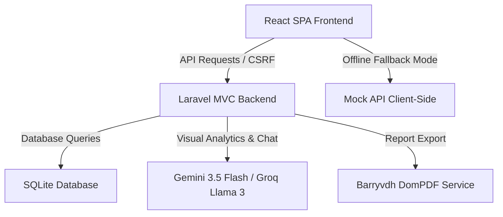

# GiziKu (NURA — Nutrisi & Urgensi Remaja-Anak)

GiziKu (officially documented as **NURA**) is a modern web and mobile-optimized health platform designed to combat stunting and anemia in children and expectant mothers across Indonesia. Built for hackathons and public health initiatives, GiziKu merges dataset visualization with on-device AI screening to assist parents and healthcare workers in rural or low-connectivity areas.

---

## 📋 Project Summary

GiziKu addresses critical public health challenges by delivering three key pillars of value:
1. **AI-Powered Visual Screening:** Parents can capture or upload photos of their child's face, eyes (conjunctiva), and nails to instantly evaluate indicators of stunting and anemia (e.g., conjunctival paleness for hemoglobin estimates).
2. **Interactive National Dataset Map:** Displays stunting prevalence, health facility availability, and urgency levels across all 34 provinces of Indonesia. The data is backed by curated datasets (from sources like `stunting_indonesia_final.xlsx`).
3. **Conversational Support & Health Hub:** Features **NURA Assistant AI**, a chatbot designed to guide parents with advice on nutrition, child immunization schedule, and anemia prevention. It also includes localized maps of the nearest Puskesmas, clinics, or Posyandu, alongside interactive health educational quizzes.

---

## 🏗️ Architectural Overview & Development Process

The project is architected with a decoupled structure where Laravel serves as a robust API and page-rendering framework, and React drives a responsive, touch-first Single Page Application (SPA).



### 1. The Monolithic Backend (Laravel 13 + SQLite)
* **API & Controller Layer:** Controllers such as `MentalHealthScanController` and `AuthController` handle core authentication (including Google OAuth via Laravel Socialite), process manual stunting datasets, generate clinical PDF reports (`laravel-dompdf`), and orchestrate AI request chains.
* **AI Orchestration & Fallbacks:** A dedicated `GeminiService` interfaces with the Gemini API (using `gemini-3.5-flash` primary model and multiple flash fallbacks) and the Groq API (calling `llama-3.3-70b-versatile` for text completions). 
* **Provincial Datasets:** A custom migration seeds stunting metrics into `province_stunting_data` from spreadsheets to power the interactive map.

### 2. The SPA Frontend (React 19 + Tailwind CSS 4 + Vite 8)
* **Platform-Adaptive Rendering:** Dynamically detects device viewport height/width using a custom hook (`useIsDesktop`). It renders the `DesktopApp` (using a persistent sidebar navigation) or the `MobileApp` (using a bottom-tab system) while sharing state.
* **Daylight-Ready Design System:** Designed for outdoor reliability in remote areas using a high-contrast theme (pure white background and rich navy foreground) and generous touch target areas (minimum 44×44px).
* **Graceful Degradation / Off-Grid Support:** In areas with poor network coverage, the frontend's custom HTTP handler (`api.js`) automatically intercepts failed requests and redirects them to a local mock database containing sample diagnostics, articles, and a rule-based offline chatbot.

---

## 🛠️ Development Tools Used

### Backend Stack
* **Language & Runtime:** PHP 8.3+
* **Framework:** Laravel 13.8 (including Tinker, Socialite, and standard auth structures)
* **Database:** SQLite (local lightweight database)
* **Libraries:** 
  * `barryvdh/laravel-dompdf` for generating portable, downloadable PDF reports.
  * `laravel/socialite` for Google OAuth 2.0 user login flow.

### Frontend Stack
* **Runtime & Bundler:** Node.js, Vite 8, Laravel Vite Plugin
* **Libraries:** React 19, Lucide React (Icons), FontAwesome
* **Styling:** Tailwind CSS v4.0

### Quality Assurance & Devops
* **Concurrently:** Running PHP serve, Vite watch, and Laravel queue listeners simultaneously.
* **Testing:** PHPUnit 12, Mockery (mocking library), Laravel Pail & Pao.
* **Data Seeding:** FakerPHP (fake data generator) and custom Excel parsers.

---

## 🚀 Getting Started & Execution

### Prerequisites
* PHP 8.3 or higher with typical extensions (SQLite, BCMath, etc.)
* Composer
* Node.js & npm

### Installation
Clone the repository and run the unified setup command which automates environment configuration, database migration, seeding, and building frontend assets:

```bash
composer run setup
```

### Running Locally
To launch the application (which spins up the local PHP server, Vite builder, and background job queue listeners in parallel):

```bash
composer run dev
```

The web application will be accessible at `http://localhost:8000`.
